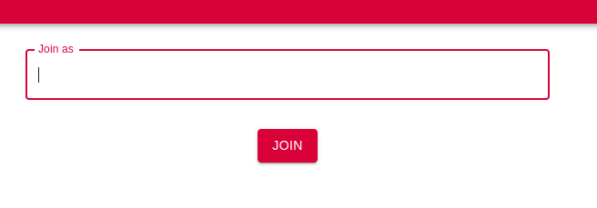
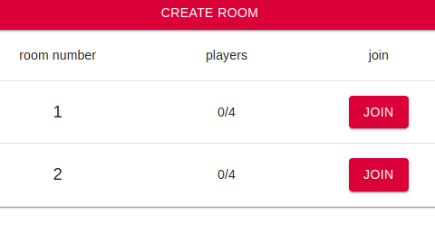
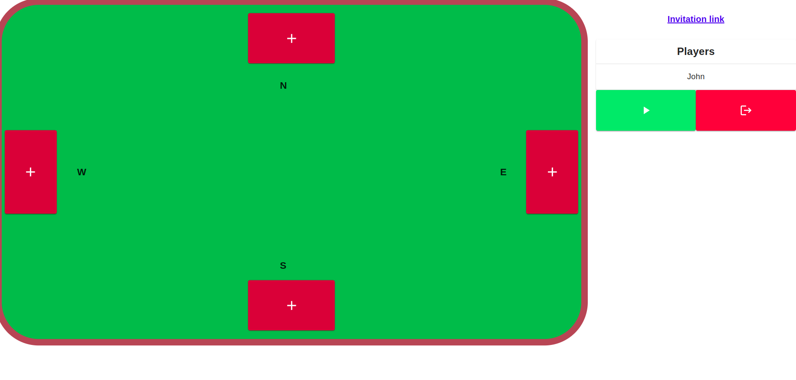
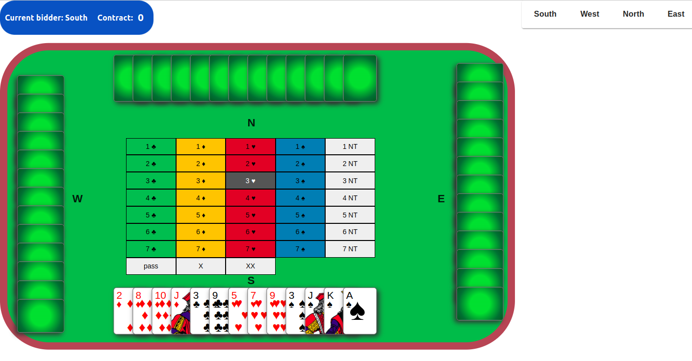

# Brydż Documentation

## Table of Contents
- [Brydż Documentation](#brydż-documentation)
  - [Table of Contents](#table-of-contents)
  - [Introduction](#introduction)
  - [Installation](#installation)
  - [Usage](#usage)
  - [Contributing](#contributing)

## Introduction
Brydż is a simple bridge bidding system. It is designed to be easy to use while still being powerful enough to be used in a competitive environment.

It was created in 2023 as a project for the "Software Engineering" course at the University of Warsaw.

## Installation

To install and run on your local or remote machine, do the following in the root directory:
* checkout the repo with submodules
```console
git clone ...
git submodule init
git submodule update
```
* install npm
```console
cd client
npm install --prefix client
```
* start the server
```console
npm start --prefix client
```

## Usage
1. Join screen
   
    
    To use Brydż, you must first enter your name. This is used to identify you in the game. The name doesn't have to be unique, as the site identifies the user by a randomly generated name. Next, you must press the "Join" button to go to the lobby page, or if you have joined via an invitation link, directly to the waiting room.

2. Lobby
   
    

    Once you have entered your name, you will be taken to the lobby. Here you can see all the available rooms.
    1. You can either create your room by pressing "CREATE ROOM" on top.
    2. Or you can join an existing room by pressing "JOIN". You can see the room number and how many players are already in that room. If the room is full (has four players in it), the button will be greyed out, which means it's disabled.

3. Waiting room

    

    Once you have joined or created a room, you will be taken to the waiting room. On top is the room id you are currently in. In the box on the right, you can see two buttons for, respectively, starting the game and leaving the room, the list of all players, identified by their nicknames, that have joined the room and the invitation link, which you can copy, and send to a friend that you would like to play with. After choosing his nickname, he will be immediately sent to your room.
    On the left, you can find the table interface. You can select your seat by pressing one of the red plus buttons around the table. If the button is greyed out, it means that the seat is already taken. Once all seats have been taken, the creator of the room can start the game by pressing the green play button.

4. Game

    

    1. Bidding/auction

    The table and your cards are represented on the left, and the bidding part starts.
    Here, starting with the dealer and turns following in a clockwise direction, players take turns bidding from standard bridge bids. We can choose from: 1-7 ♣/♦/♥/♠/NT(no trump), X (double), XX (redouble) and pass by pressing on buttons representing the corresponding bids. Players can only bid higher than the previous bid or bid pass/X/XX. You can bid double, only the opposing pair has the highest bid, and only if their contract hasn't already been doubled - this roughly makes the contract have double the reward for them after winning it and double the reward for your pair after them losing. You can also bid redouble after opponents have doubled your contract and your pair haven't redoubled it yet, which behaves similarly to the double, but quadruples the points. The bidding part ends after three consecutive passes, which makes the highest bid the played contract and the game goes to the next stage.   
    On the top left, we find a box containing information about the current player and the highest bid. On the right is the auction box, representing the history of the bidding. 

    2. Play
    
    Here, again, the table and the cards are on the left. On top left we see basic informations about the play - the contract, our and their won tricks, and the current trick number. On the right is the history of the bidding (the same as in the bidding stage) and a small diagram showing cards played in the last trick.
    The play is a standard bridge game, and as there are no variants to it, we won't talk about the details. You select the card by pressing the corresponding card in your hand. [TODO] After finishing the play, pairs get points depending on the tricks taken and the contract, and if neither of them has enough points, the game continues from the bidding stage. Otherwise, you will receive a message about the results, and you are taken to the waiting room.

## Contributing
    Team members:
    - Michał Kostyk
    - Mikołaj Zakrzewski
    - Mateusz Piekarczyk